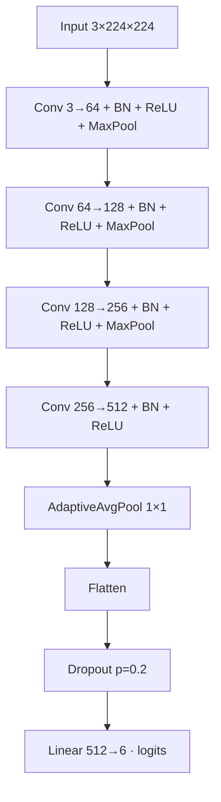
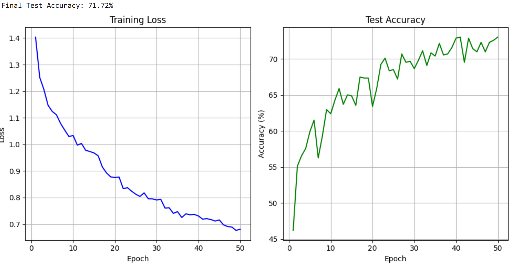

# <h1 align="center">ECE 046217 - Technion - Deep Learning - Project </h1> 
## <h2 align="center"> "Thats not what i ordered!" - A Deep Learning beer classification model </h2>

<h4 align="center">
  <table align="center" style="border: none;">
    <tr style="border: none;">
      <td align="center" style="border: none;">
        

            
          <strong>Lavie Lederman</strong>  
          
          
        

      </td>
      <td align="center" style="border: none;">
        

            
          <strong>Barry Shafran</strong>  
          
          
        

      </td>
    </tr>
    <tr style="border: none;">
      <td colspan="2" align="center" style="border: none">
        <a href="https://youtu.be/..." target="_blank">//presentation vid
          
        </a>
      </td>
    </tr>
  </table>
</h4>

## Abstract
Don’t you hate it when you drink a beer and don’t know what type it is? Or when the waiter mixes up your order?

In this project, we used the Untappd site and processed the data using the YOLO object detection model. On the modified dataset, we applied several augmentations and tested different state-of-the-art classification models, including DINO and EfficientNet, comparing their performance in recognizing beer types from visual input. We evaluated the results using different approaches to the data efficiency problem (freeze-out, fine-tuning, and partial training). 

We also compared our results to a “human benchmark,” implemented as a GUI game for human beer detection, as well as to a basic model we built ourselves.

  //change

## Table of Contents
* [Files in the repository](#Files-in-the-repository)
* [Installation Instructions](#Installation-Instructions)
  * [Libraries to Install](#Libraries-to-Install)
* [How to Use](#How-to-Use)
* [Dataset](#Dataset)
* [Object Detection Models](#Object-Detection-Models)
  * [Hyperparameter Tuning](#Hyperparameter-Tuning)
* [Training Results](#Training-Results)
* [Data Augmentations](#Data-Augmentations)
* [Post Augmentations Results](#Post-Augmentations-Results)
* [Potholes Severity](#Potholes-Severity)
* [References](#References)

## Files in the repository

| File Name                       | Purpose                                                                 |
|---------------------------------|-------------------------------------------------------------------------|
| `login_and_get_links.py`        | login to untapd website and retrive links for specified beer type photos.|
| `download.py`                   | uses the image linkes to go and download all the wanted photos.         |
| `sortToCupNoCup.py`             | using YOLO model to identify and crop out the beers for the photos      |
| `selfTest.py`                   | A simple GUI game to test human ability to solve our problem, used as a benchmark. |
| `fullModelTest.py`              | a script that pipelines the process from the uncropped untagged image input to a results with bbox and tags. |
| `BeerDL_50_augmented.ipynb`     | Jupyter notebook for a simple CNN version of a beer classifier.                 |
| `BeerDL_lavie_model.ipynb`      |** Jupyter notebook for Lavie's version of a beer classifier. **                     |
| `EffnetAndDinoTraining.ipynb`   |  Jupyter notebook for comparing DINO and EffNet   |
| `config!!!!11!!!!`                        | Directory containing environment configuration files.                   |
| `data`                          | Directory containing all the datasets and results                       |
| `HW`                            | Directory for our homework assigments.                                  |

## Installation Instructions

1. Get Anaconda with Python 3, follow the instructions according to your OS (Windows/Mac/Linux) at [link](https://www.anaconda.com/download)
2. Install the packages bellow.
3. Alternatively, you can use [requirements.txt](./requirements.txt) and run 'pip install -r requirements.txt'.

### Core Deep Learning & Computer Vision

| Library | Installation Command |
|---------|----------------------|
| [PyTorch](https://pytorch.org/) | `pip install torch` |
| [torchvision](https://pytorch.org/vision/stable/) | `pip install torchvision` |
| [opencv-python](https://opencv.org/) | `pip install opencv-python` |
| [ultralytics](https://docs.ultralytics.com/) | `pip install ultralytics` |
| [timm](https://github.com/huggingface/pytorch-image-models) | `pip install timm` |

### Data Processing & Analysis

| Library | Installation Command |
|---------|----------------------|
| [numpy](https://numpy.org/) | `pip install numpy` |
| [pandas](https://pandas.pydata.org/) | `pip install pandas` |

### Image Processing & Visualization

| Library | Installation Command |
|---------|----------------------|
| [Pillow (PIL)](https://pillow.readthedocs.io/) | `pip install Pillow` |
| [matplotlib](https://matplotlib.org/) | `pip install matplotlib` |

### Web Scraping & Data Collection

| Library | Installation Command |
|---------|----------------------|
| [selenium](https://selenium-python.readthedocs.io/) | `pip install selenium` |
| [beautifulsoup4](https://www.crummy.com/software/BeautifulSoup/) | `pip install beautifulsoup4` |
| [requests](https://requests.readthedocs.io/) | `pip install requests` |

### User Interface & Utilities

| Library | Installation Command |
|---------|----------------------|
| [tkinter](https://docs.python.org/3/library/tkinter.html) | `pip install tk` |
| [tqdm](https://tqdm.github.io/) | `pip install tqdm` |

## How to Use
After installing the required libraries, you can run the `fullModelTest.py`to see the results for a custom photo.
If you wish to train the models and evaluate them your self you can run the notebooks under `src` which contain the training and evaluation process for the all the models we analysed.
If you wish to test yourself, you can run 'selfTest.py' and have fun. 

You can also download our weights from the following link:
- [Google Drive](https://drive.google.com/drive/folders/1Zj22MpCoxBWR9_azWvHRTWe_qfoa9Fsj?usp=drive_link)//barry link wieght 
  
  Just download the `models.zip` file and replace it with the existing `./data/models` folder in the repository.

## Gathering the Dataset
We could not fiind any tagged dataset that would help our project so we used avaliable resources and some deep learning models to create the needed dataset. 
We wrote a [script](./data_changes/login_and_get_links.py) that gathers links for photos from the online website for beer lovers [Untappd]([untapped link](https://untappd.com/)), using the tags from the website itself as out correct labels(for example, we send the script to download all photos of a beer we know is a wheat beer, thus we created a "labeled" dataset, after gathering the links we used another [script](./data_changes/download.py) to download them/
Next, since all the photos we user uploaded(social media like) we had a lot of irrelevant objects in the photos, so we used the pre-trained YOLO_v2 for its object detection and bbox features to get only the images of the beers themselves.
Note that the YOLO model only had options for detecting cups or bottles, so we still had to manuelly delete a few dozen photos, but we used them for out control group as "not beer" label.
link to dataset:

  

## Imported models
In this project we trained (except) the following models and used:

- `efficientnet_b0` [EfficientNet (TensorFlow Implementation)](https://github.com/tensorflow/tpu/tree/master/models/official/efficientnet) – Used as a benchmark model for comparison.
- `vit_base_patch16_224_dino` [DINO (Facebook Research)](https://github.com/facebookresearch/dino) – Used as a benchmark model for comparison.
- `yolov8n` [YOLOv8 models documentation](https://docs.ultralytics.com/models/yolov8/)

### Hyperparameter Tuning
A comprehensive search was performed across multiple hyperparameter spaces, including model preweight strategies, learning rates, momentum, and weight decay parameters.
The study involved carefully selecting combinations of hyperparameters to achieve the best validation score.
Below is a detailed table of the tuned hyperparameters.

| **Category**   | **Hyperparameter** | **Value / Range Used**               | **Description**                                   |
|----------------|--------------------|---------------------------------------|---------------------------------------------------|
| Model          | `preweight_mode`   | `random`                              | Model trained from scratch (no pretrained weights)|
| Training       | `batch_size`       | `64`                                  | Number of samples per training batch              |
| Training       | `epochs`           | `5` (search), `50` (our CNN) , '20' (improted models)           | Trials for tuning, then final full run            |
| Optimizer      | `optimizer`        | `AdamW`                               | Optimization algorithm                            |
| AdamW          | `lr`               | `[1e-4, 1e-3]` (log scale)            | Learning rate for AdamW (tuned)                   |
| AdamW          | `weight_decay`     | `[1e-6, 1e-3]` (log scale)            | Weight decay regularization (tuned)               |
| Regularization | `dropout`          | `[0.1, 0.6]`                          | Dropout probability in classifier layers (tuned)  |
| Scheduler      | `scheduler`        | `ReduceLROnPlateau`                   | Learning rate scheduler type                      |
| Plateau        | `factor`           | `0.5`                                 | Decay factor for ReduceLROnPlateau                 |
| Plateau        | `patience`         | `[2, 4]`                              | Patience for ReduceLROnPlateau (tuned)             |

- The best configurations for each model was saved for future training.
- At the end, each configuration was set to be trained with a batch size of 64 for 40 epochs.

## Training Results

### our model's architecture

### Model results with no data augmentations
 

*No Augmentations Test Accuracy: **72.30%** — Trained without data augmentations. Accuracy improves rapidly in the first 15 epochs and then plateaus around ~68–70%. The steady loss decrease indicates consistent learning, but the absence of augmentations likely limits the model’s ability to generalize to unseen variations.*

## Data Augmentations

We applied different transformations for training and evaluation to ensure robust learning while keeping validation/testing consistent and unbiased.  
All transforms were implemented using [torchvision.transforms](https://pytorch.org/vision/stable/transforms.html).

### **Training Transformations**
| **Augmentation**          | **Parameters**                                      | **Description**                                                                 |
|---------------------------|------------------------------------------------------|---------------------------------------------------------------------------------|
| `Resize`                  | `(256, 256)`                                        | Resize the input image to a fixed size of 256×256 pixels.                       |
| `RandomCrop`              | `IMG_SIZE`                                          | Randomly crop the image to `IMG_SIZE`×`IMG_SIZE` pixels.                        |
| `RandomHorizontalFlip`    | *(default p=0.5)*                                   | Flip the image horizontally with a probability of 0.5.                          |
| `ColorJitter`             | `(brightness=0.3, contrast=0.3, saturation=0.3, hue=0.05)` | Randomly change image brightness, contrast, saturation, and hue.                |
| `RandomRotation`          | `15`                                                | Rotate the image randomly within ±15 degrees.                                   |
| `ToTensor`                | —                                                   | Convert the image to a PyTorch tensor.                                          |
| `Normalize`               | `mean=[0.485, 0.456, 0.406], std=[0.229, 0.224, 0.225]` | Normalize pixel values using ImageNet statistics.                               |

### **Evaluation Transformations**  
| **Augmentation**          | **Parameters**                                      | **Description**                                                                 |
|---------------------------|------------------------------------------------------|---------------------------------------------------------------------------------|
| `Resize`                  | `(IMG_SIZE, IMG_SIZE)`                              | Resize the input image to `IMG_SIZE`×`IMG_SIZE` pixels.                         |
| `ToTensor`                | —                                                   | Convert the image to a PyTorch tensor.                                          |
| `Normalize`               | `mean=[0.485, 0.456, 0.406], std=[0.229, 0.224, 0.225]` | Normalize pixel values using ImageNet statistics.                               |

### **General Transformations**  
| **Augmentation**          | **Parameters**                                      | **Description**                                                                 |
|---------------------------|------------------------------------------------------|---------------------------------------------------------------------------------|
| `Resize`                  | `(224, 224)`                                        | Resize the input image to 224×224 pixels.                                       |
| `ToTensor`                | —                                                   | Convert the image to a PyTorch tensor.                                          |

### **Additional Augmentation Pipeline for Dataset Expansion**

To further increase dataset diversity and size, we created an **additional augmented sample for every original image** using the following transformations:

| **Augmentation**          | **Parameters**                                      | **Description**                                                                 |
|---------------------------|------------------------------------------------------|---------------------------------------------------------------------------------|
| `Resize`                  | `(256, 256)`                                        | Resize the input image to 256×256 pixels.                                       |
| `RandomCrop`              | `224`                                               | Randomly crop the image to 224×224 pixels.                                      |
| `RandomHorizontalFlip`    | *(default p=0.5)*                                   | Flip the image horizontally with a probability of 0.5.                          |
| `RandomRotation`          | `20`                                                | Rotate the image randomly within ±20 degrees.                                   |
| `RandomAffine`            | `degrees=15`, `translate=(0.1, 0.1)`, `scale=(0.9, 1.1)` | Apply random affine transformations with rotation, translation, and scaling.   |
| `RandomPerspective`       | `distortion_scale=0.3`, *(default p=0.5)*           | Apply a random perspective transformation to simulate viewpoint changes.        |
| `ToTensor`                | —                                                   | Convert the image to a PyTorch tensor.                                          |
| `ToPILImage`              | —                                                   | Convert the tensor back to a PIL image (for further processing or visualization).|

**Note:** This process effectively **doubled the dataset size** by generating one additional augmented image for every original photo.

## Results

### Barry's model results

 

*Barry's Test Accuracy: **72.59%** — Accuracy improves steadily throughout training, reaching a plateau near the end. Loss decreases consistently, indicating stable learning without major overfitting. However, the final accuracy is lower compared to other approaches, suggesting that this configuration may lack sufficient capacity to capture all dataset-specific patterns.*

### Lavie's model results
 

*Lavie's Test Accuracy: **71.72%** — Accuracy improves quickly in the first 10 epochs, then gradually climbs toward ~72%. The steady decline in training loss suggests consistent learning without severe overfitting. However, the relatively early plateau in accuracy indicates that the model may be limited by its capacity or the features being used, preventing it from capturing all class distinctions effectively.*

### Effnet results

### Model Performance Comparisons

| **DINO – Feature Extraction** | **DINO – Partial Freezing** | **DINO – Full Fine-Tuning** |
|-------------------------------|-----------------------------|-----------------------------|
|  |  |  |
| *Final Test Accuracy: **73.91%** — Training is stable but accuracy plateaus early, suggesting that frozen pre-trained features limit adaptation to beer-specific patterns.* | *Final Test Accuracy: **83.53%** — Significant improvement from feature extraction. Accuracy stabilizes after ~5 epochs, showing that fine-tuning later layers captures more domain-specific details.* | *Final Test Accuracy: **80.76%** — Lower than partial freezing despite full fine-tuning. Likely due to overfitting or disruption of pre-trained features during training.* |

### Dino results

| **EfficientNet – Feature Extraction** | **EfficientNet – Partial Freezing** | **EfficientNet – Full Fine-Tuning** |
|---------------------------------------|--------------------------------------|--------------------------------------|
|  |  |  |
| *Final Test Accuracy: **67.76%** — The lowest-performing setup overall. Limited adaptation to the dataset due to frozen features.* | *Final Test Accuracy: **83.67%** — Large jump in accuracy, showing partial fine-tuning is highly effective for EfficientNet on this dataset.* | *Final Test Accuracy: **87.78%** — The best performance overall, with a steady accuracy climb and minimal overfitting.* |

## References

- [Untappd – Discover Beer](https://untappd.com) – Source for beer images and type labels.
- [YOLOv2 by Joseph Redmon](https://pjreddie.com/darknet/yolov2/) – Used for initial dataset object detection and cropping.
- [DINO (Facebook Research)](https://github.com/facebookresearch/dino) – Used as a benchmark model for comparison.
- [EfficientNet (TensorFlow Implementation)](https://github.com/tensorflow/tpu/tree/master/models/official/efficientnet) – Used as a benchmark model for comparison.

